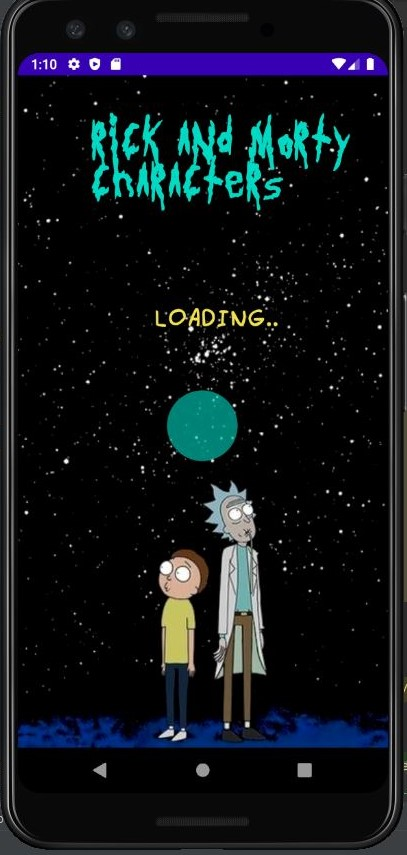

# Rick-and-Morty-Characters

<h1> Project </h1>

  This project is an Android application that provides details about “Rick and Morty” series characters. This project developed in Java. Glide library is used for displaying images. Retrofit library is used for communicating with web service (REST API).  

<h1> MVVM Architecture & Packages of The Project </h1>
<ul>
  <li>In the project, viewmodels package represents ViewModel layer in MVVM architecture</li>
  <li>In the project, repository package represents Repository layer in MVVM architecture./li>
  <li>In the project, models package represents Repository layer in MVVM architecture.</li>
  <li>In this project, adapters package is used for arranging some UI components.</li>
  <li>In this project, requests package handles Retrofit library operations. </li>
</ul>

<h1> SCREENS </h1>

<b> Note: </b> 
 The project is implemented on Pixel 3 API 28 virtual device. 

